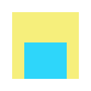
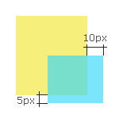

# align

Align the specified elements.

## Getting Started
Before anything taking its part, you should install [node](http://nodejs.org) and "cortex".

#### Install Node

Visit [http://nodejs.org](http://nodejs.org), download and install the proper version of nodejs.

#### Install Cortex

    # maybe you should use `sudo`
    npm install -g cortex

## Using `align` In Your Project

First, install 'align' directly with `cortex install`
	
	cortex install align --save
    
Then, use `require` method in your module
    
    var align = require('align');


## Synopsis

```js
align(element).to(target, [from, to], options);
```

The code above will coincide the `from` point of `element` with the `to` point of the `target`.

#### element

type `Element|jQueryElement`, the element to be placed.

#### target

type `Element|jQueryElement|'viewport'`, the target which `element` will be aligned to.

#### from, to

type `String`, the symbol of a specific point

There are 7 points for a single rectangle:

```
TL ----------- TC ----------- TR
|                              |
|                              |
|                              |
|                              |
LC             CC             RC
|                              |
|                              |
|                              |
|                              |
BL ----------- BC ----------- BR
```


```
align(blue).to(yellow, ['TL', 'BL']);
```



```
align(blue).to(yellow, ['BC', 'BC']);
```



```
align(blue).to(yellow, ['BR', 'BR'], {
	adjust: {
		top: -5,
		left: 5
	}
});
```


#### options

- `adjust.left` {number} the horizontal offset
- `adjust.top` {number} the vertical offset
- `fix` {boolean=false} if `true`, the element will be fixed to the destination position.

